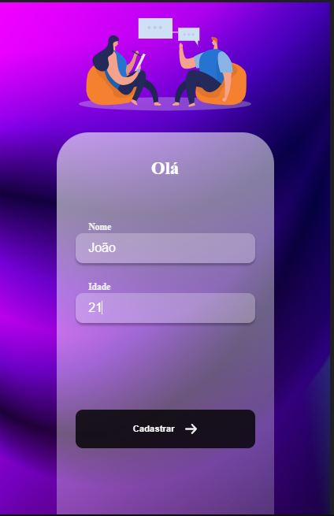
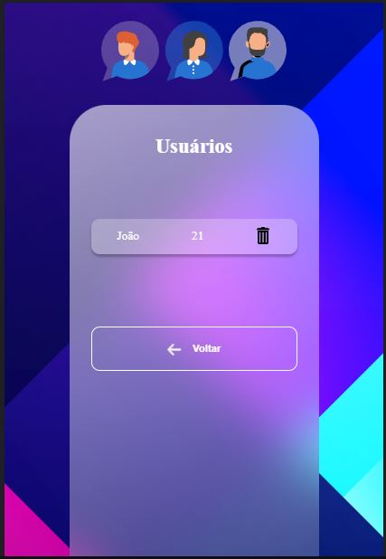
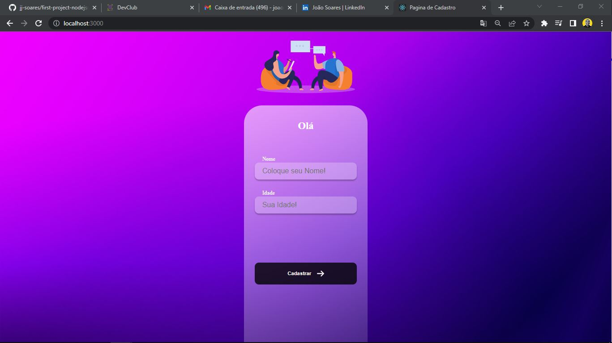
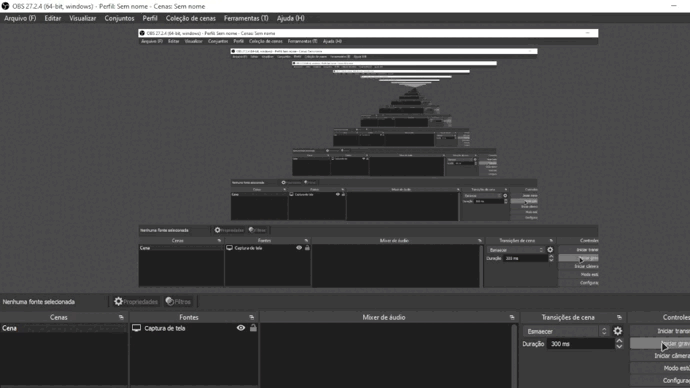

<h1 align="center">
User registration screen  😎
</h1>

<h4 align="center">
  😉 First project created with React.js
</h4>

<p align="center">   
   <a href="#on">On</a> .
   <a href="#roadmap">Roadmap</a> .
   <a href="#technologies">Technologies</a> .
   <a href="#photos">Photos</a> . 
   <a href="#author">Author</a> 
   
 </p>


   
 ## On 
     
   <p> Learning features of Styled components, React Hooks, React router dom!!!</p>
   
   
   
 ## Roadmap 
   
   <p> This project aims to make the connection between the Back-end and the Front-end, in the Back-end Node.js was used with express framework, and in the Front-end the styling was on account of React, Styled Components, React router dom, and some React Hooks!!</p>
   
   
 ## Technologies
   
   <h3 align="center"> Technologies used in the project 🙃 </h3>
   
   

- [React](https://pt-br.reactjs.org/)  
- [Styled components](https://styled-components.com/)  
- [JavaScript](https://www.javascript.com/)
- [Yarn](https://yarnpkg.com/)  
- [Node.js](https://nodejs.org/en/)  
- [Express](https://expressjs.com/pt-br/)  
 
<br>
<br>

## Running the project

```bash
# Clone Repository
$ git clone 

# Install Dependencies
$ yarn install or npm install

# Run Aplication
$ yarn start or npm start 

# Don't forget to clone the API
$ git clone https://github.com/jj-soares/first-project-nodejs

```
Go to http://localhost:3000/ to see the result.

   
## Photos
   
    
   
    
   
   
   

## Author
   <p> Hello, my name is João. <br> Follow me on <a href="https://www.linkedin.com/in/jo%C3%A3o-soares13/" target="_blank">Linkedin</a> to see more about the projects I post.!</p>

## License 

This project is under the [MIT license](./LICENSE).


   
